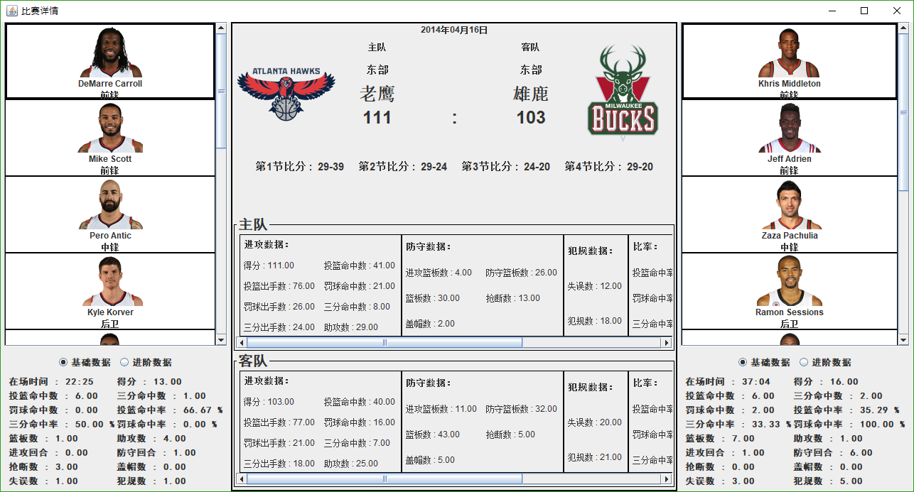
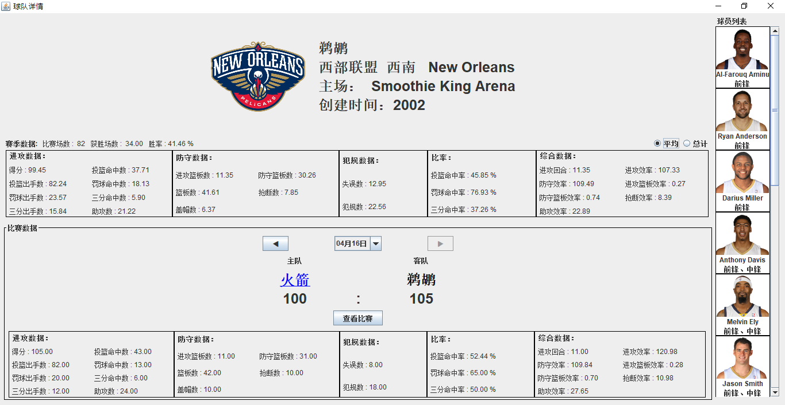
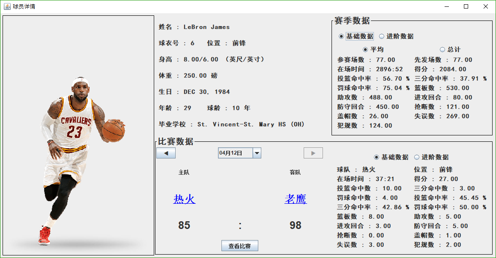
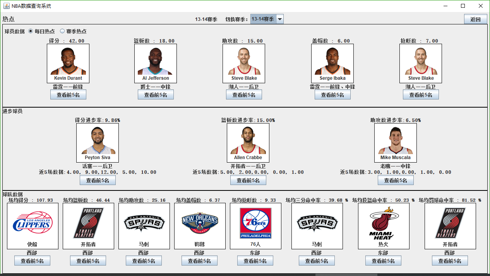

# NBA Data Viewer
A course project. Written by Kelei Xu, Peiji Wang and me in Nanjing University in 2015.

Written in pure Java. Able to run remotely with a server with RPC. GUI is written with Swing and only in Chinese.

Another version with alternative GUI and extra feature written by Kelei Xu, Peiji Wang, me and Xin Jin is [here](https://github.com/xinjin1994/NBA-Data-Analysis-System).

## Introduction
A comprehensive NBA data viewer. Display fundamental and advanced statisticss about NBA players, teams and matches. Rankings are also provided either by daily or seasonal basis.

## ScreenShots

The match view with statistics of team performance and indivisual player performance.

The team view with seasonal summary and statistics by match.

The player view with seasonal summary and statistics by match.

The ranking view displaying the best player or team on various criteria.

A detailed ranking view displaying the statistics of the top five teams.

A detailed ranking view displaying the statistics of the top five players.

